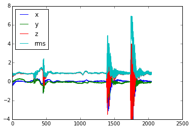
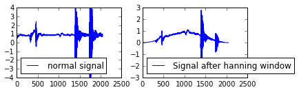
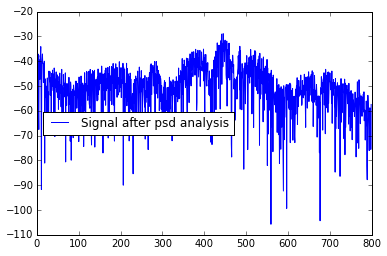
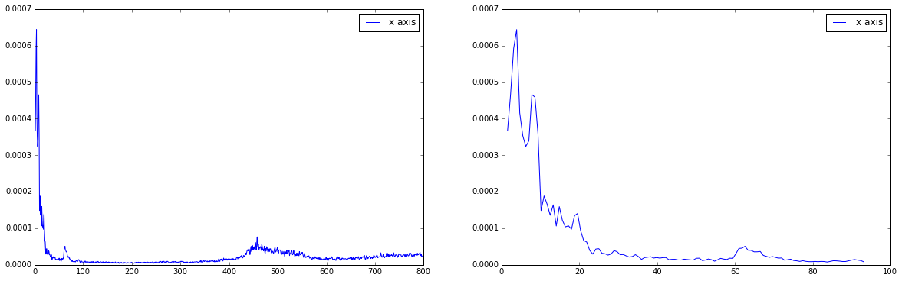
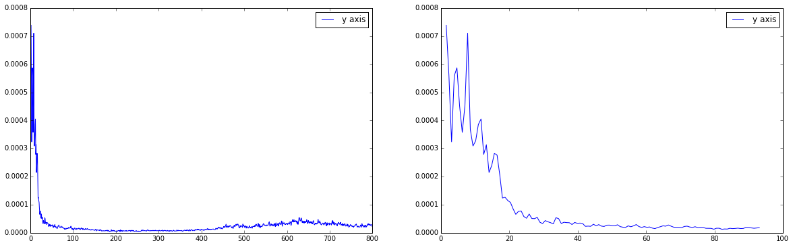
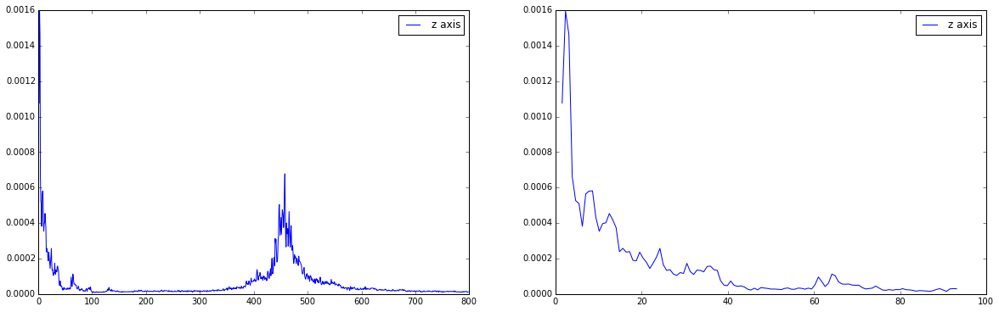

Signal Analysis
==================

Setup
-----

.. code:: bash
virtualenv env
source env/bin/activate
pip install requirements.txt

Run the ipython notebook notebook
-----------------------------------
.. code:: bash
ipython notebook

Analysing vibration events
==========================
1. Import all the necessary library to process:
-----------------------------------------------

.. code:: python

    #importing libraries for plotting
    %matplotlib inline
    import matplotlib.pyplot as plt
    import json
    import math
    import numpy as np

2. Helper code for processing the data
--------------------------------------

.. code:: python

    def splitAndConvert(value,splitter = ' '):
    	return map(float,value.split(splitter))

    def getRMSData(x,y,z):
    	return [ math.sqrt((x[i]*x[i])+(y[i]*y[i])+(z[i]*z[i]))  for i in xrange(0,2048)]

    def loadEvents():
    	events = []
    	with open('vibration.json') as data_file:
    	    	for line in data_file:
    			event = json.loads(line)
    			event['x'] =  splitAndConvert(event['value']['x']);
    			event['y'] =  splitAndConvert(event['value']['y']);
    			event['z'] =  splitAndConvert(event['value']['z']);
    			event['rms'] = getRMSData(event['x'],event['y'],event['z'])
    			del event['value'];
    			events.append(event)
    	return events

    def processPSD(events, axis):
    	psds = []
    	for event in events:
    		signal = np.array(event[axis], dtype=float)
    		fourier = np.fft.fft(signal*np.hanning(2048))
    		psd = 2*((fourier.real * fourier.real)/(1600*2048))
    		psds.append(psd)
    	return psds

    def consolidatePSD(psds):
    		dArray = np.array(psds)
    		#print 'Data type                :', dArray.dtype
    		#print 'Total number of elements :', dArray.size
    		#print 'Number of dimensions     :', dArray.ndim
    		#print 'Shape (dimensionality)   :', dArray.shape
    		#print 'Memory used (in bytes)   :', dArray.nbytes
    		vibrationTable = []
    		for i in xrange(0,2048):
    			vibrationTable.append(np.sum(dArray[:,i])/len(psds))

    		return vibrationTable

    def processData():
    	events = loadEvents()
    	table = {}
    	table['x'] = consolidatePSD(processPSD(events,'x'))
    	table['y'] = consolidatePSD(processPSD(events,'y'))
    	table['z'] = consolidatePSD(processPSD(events,'z'))
    	table['rms'] = consolidatePSD(processPSD(events,'rms'))
    	return table

3. Display sample data for 3 axis
---------------------------------

.. code:: python

    data = loadEvents()
    print "No of Events recorded :", len(data)
    plt.plot (data[0]['x'], label="x")
    plt.plot (data[0]['y'], label="y")
    plt.plot (data[0]['z'], label="z")
    plt.plot (data[0]['rms'],  label="rms")
    plt.legend(loc='upper left')

.. parsed-literal::

    No of Events recorded : 334

.. parsed-literal::

    <matplotlib.legend.Legend at 0x105f3fd50>

4. Display a sample signal with hanning window and after psd analysis
---------------------------------------------------------------------

.. code:: python

    import numpy as np
    signal = np.array(data[0]['z'], dtype=float)
    plt.subplot(2,2,1)
    plt.plot(signal,label="normal signal")
    plt.legend(loc='lower left')
    plt.subplot(2,2,2)
    plt.plot(signal* np.hanning(2048),label="Signal after hanning window")
    plt.legend(loc='lower left')
    plt.figure()
    fourier = np.fft.fft(signal*np.hanning(2048))
    n = signal.size-3
    timestep = 0.000625
    freq = np.fft.fftfreq(n, d=timestep)
    psd = (fourier.real * fourier.real)/(1600*2048)
    psd  = np.array(psd, dtype=float)
    psd[2:n-1] =  2* psd[2:n-1]
    plt.plot(freq[2:n/2], 10*np.log10(psd[2:n/2]),label="Signal after psd analysis")
    plt.legend(loc='center left')

.. parsed-literal::

    <matplotlib.legend.Legend at 0x10c782590>

5. Consolidating the report
---------------------------

.. code:: python

    data = processData()
    from scipy.integrate import simps, trapz
    graph = data['x'][2:n/2-1]
    # Compute the area using the composite trapezoidal rule.
    area = trapz(graph, dx=5)
    print("trapezoidal area x=", area)

    # Compute the area using the composite Simpson's rule.
    area = simps(graph, dx=5)
    print("Simpson x =", area)

    graph = data['y'][2:n/2-1]
    # Compute the area using the composite trapezoidal rule.
    area = trapz(graph, dx=5)
    print("trapezoidal area y=", area)

    # Compute the area using the composite Simpson's rule.
    area = simps(graph, dx=5)
    print("Simpson y =", area)

    graph = data['z'][2:n/2-1]
    # Compute the area using the composite trapezoidal rule.
    area = trapz(graph, dx=5)
    print("trapezoidal area z=", area)

    # Compute the area using the composite Simpson's rule.
    area = simps(graph, dx=5)
    print("Simpson z =", area)

    graph = data['rms'][2:n/2-1]
    # Compute the area using the composite trapezoidal rule.
    area = trapz(graph, dx=5)
    print("trapezoidal area rms=", area)

    # Compute the area using the composite Simpson's rule.
    area = simps(graph, dx=5)
    print("Simpson rms =", area)

    n = signal.size-3
    timestep = 0.000625
    freq = np.fft.fftfreq(n, d=timestep)
    plt.figure(figsize=(20, 6))
    plt.subplot(1,2,1)
    plt.plot(freq[2:n/2-1], data['x'][2:n/2-1],label = 'x axis' )
    plt.legend(loc='upper right')
    plt.subplot(1,2,2)
    plt.plot(freq[2:120], data['x'][2:120],label = 'x axis' )
    plt.legend(loc='upper right')
    plt.show()
    plt.figure(figsize=(20, 6))
    plt.subplot(1,2,1)
    plt.plot(freq[2:n/2-1], data['y'][2:n/2-1],label = 'y axis' )
    plt.legend(loc='upper right')
    plt.subplot(1,2,2)
    plt.plot(freq[2:120], data['y'][2:120],label = 'y axis' )
    plt.legend(loc='upper right')
    plt.show()
    plt.figure(figsize=(20, 6))
    plt.subplot(1,2,1)
    plt.plot(freq[2:n/2-1], data['z'][2:n/2-1],label = 'z axis' )
    plt.legend(loc='upper right')
    plt.subplot(1,2,2)
    plt.plot(freq[2:120], data['z'][2:120],label = 'z axis' )
    plt.legend(loc='upper right')
    plt.show()
    plt.figure(figsize=(20, 6))
    plt.subplot(1,2,1)
    plt.plot(freq[2:n/2-1], data['rms'][2:n/2-1],label = 'rms axis' )
    plt.legend(loc='upper right')
    plt.subplot(1,2,2)
    plt.plot(freq[2:120], data['rms'][2:120],label = 'rms axis' )
    plt.legend(loc='upper right')
    plt.show()

.. parsed-literal::

    ('trapezoidal area x=', 0.12360196506596299)
    ('Simpson x =', 0.12375189082977331)
    ('trapezoidal area y=', 0.1416781518529569)
    ('Simpson y =', 0.1417611851789779)
    ('trapezoidal area z=', 0.32075644988274854)
    ('Simpson z =', 0.32102093319348385)
    ('trapezoidal area rms=', 0.29523818043622763)
    ('Simpson rms =', 0.29480228984341683)

.. image:: output_10_4.png

